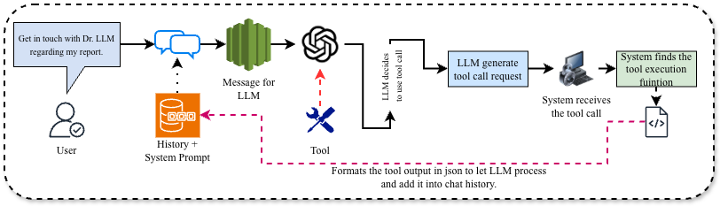

# Medical LLM Analyzer

A CLI-based medical assistant that analyzes lab reports and provides general medical guidance using multiple LLM providers and AI tools.

## Setup

1. Install dependencies: `pip install -r requirements.txt`
2. Create `.env` file with API keys:
   ```
   OPENAI_API_KEY=your_openai_key
   GOOGLE_API_KEY=your_google_key  # Optional
   PUSHOVER_USER=your_pushover_user
   PUSHOVER_TOKEN=your_pushover_token
   ```
3. Add your lab report PDF file to the directory (or specify path)
4. Run: `python main.py --pdf your_lab_report.pdf`

## Command Line Options

```bash
python main.py --pdf path/to/your/lab_report.pdf
python main.py --pdf-path path/to/your/lab_report.pdf
python main.py --help  # Show all options
```

**Default behavior:** If no PDF is specified, it looks for `lab_report.pdf` in the current directory.

## Features

- **Multi-LLM Support**: OpenAI GPT, Google Gemini, and Ollama models
- **Lab Report Analysis**: PDF text extraction and medical interpretation
- **Tool-Based Interactions**: Patient management and content moderation
- **CLI Interface**: Interactive commands and conversation history
- **Pushover Notifications**: Real-time alerts for tool usage
- **Medical Safety**: Appropriate disclaimers and professional guidance

## Supported LLMs

- **OpenAI GPT-4o-mini** (requires OPENAI_API_KEY)
- **Google Gemini 2.5 Flash** (requires GOOGLE_API_KEY)
- **Ollama Qwen3 1.7B** (requires local Ollama installation)

## Tools

- `record_patient_interest`: Saves patient contact information and sends notifications
- `record_unknown_medical_query`: Logs questions that cannot be answered due to scope limitations
- `flag_inappropriate_content`: Flags content violating medical community guidelines

### How Tools Work with LLM



The diagram above illustrates the tool calling flow:
1. **User Input** → LLM receives the query with available tools
2. **LLM Decision** → Model decides if a tool should be used
3. **Tool Execution** → Python functions execute and return results
4. **LLM Continuation** → Model receives tool results and generates final response
5. **Pushover Notification** → Real-time alerts sent for tool usage monitoring

## CLI Commands

- `/help` - Show available commands
- `/system` - Update the system prompt
- `/clear` - Clear conversation history
- `/quit` - Exit the chat interface

## Usage

The application will automatically detect available LLM providers and prompt you to select one. It loads lab reports from `lab_report.pdf` and provides medical analysis while maintaining patient safety and professional standards.
